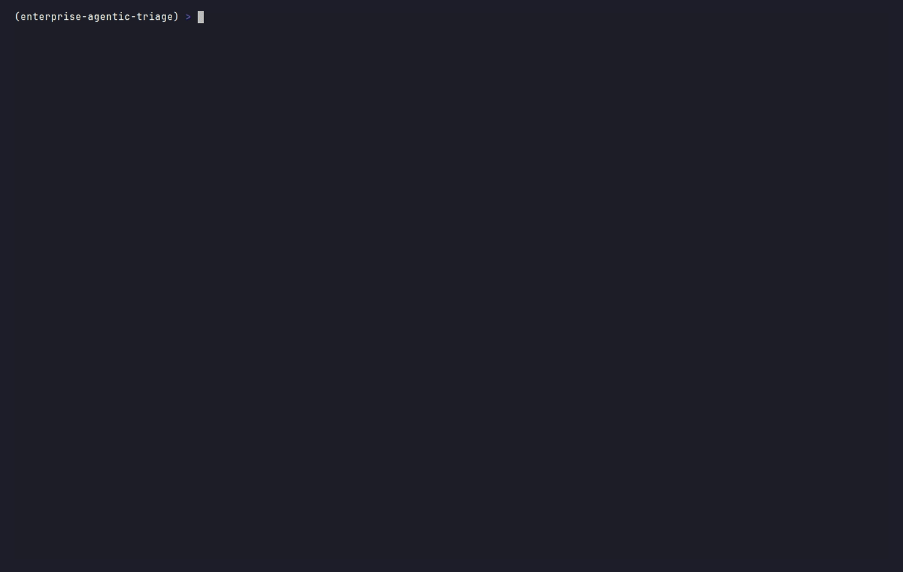

# Enterprise Triage & Resolution Agent

A production-ready **Proof of Concept** for an autonomous support-operations
middleware. It ingests support tickets via webhook, runs them through a
**stateful LangGraph workflow**, and then either:

- **resolves** the ticket automatically using an **Advanced RAG** system
  (Qdrant + semantic chunking + CrossEncoder re-ranking), or
- **executes a system action** (e.g. granting access) against a mock REST API —
  but **only after a mandatory Human-in-the-Loop (HITL) approval** at the terminal.

The reasoning layer is **pluggable**: it runs on **Claude Opus 4.8 (cloud)** or a
**local LLM served by vLLM on your own GPU** (tuned here for an **RTX 5070 +
Ryzen AI 9**), so the same workflow can run fully on-prem with zero cloud calls.

Every step is rendered with `rich` for a high-visibility, color-coded event flow.

---

## Demo



> Regenerate the recording with [`vhs`](https://github.com/charmbracelet/vhs):
> `vhs demo.tape`. See [VHS Demo](#vhs-demo) below.

---

## Why this matters (business value)

| Capability | Business impact |
| --- | --- |
| **Automated triage & resolution** | Deflects repetitive "policy lookup" tickets to an AI agent that answers from *your* knowledge base, cutting first-response time from hours to seconds and freeing L1 agents for complex work. |
| **Advanced RAG (re-ranking)** | A bi-encoder retrieves broadly; a CrossEncoder re-ranks for precision. This two-stage design materially reduces hallucination by feeding the LLM only the highest-fidelity passages — critical for trustworthy enterprise answers. |
| **HITL governance** | No state-changing action (granting access, resetting credentials) is ever executed without an explicit human approval. This is the compliance backbone: it gives you an auditable, least-privilege-by-default control point that satisfies SOC 2 / ISO 27001 change-management expectations. |
| **Deterministic orchestration** | LangGraph makes the control flow explicit and inspectable (triage → route → resolve/act), so behavior is reviewable and testable rather than an opaque prompt chain. |
| **Webhook-native** | Drops in behind any ticketing system (Zendesk, Jira, ServiceNow) via a single webhook. |

The headline outcome: **safe process automation**. Knowledge work is automated
end-to-end; privileged operations stay automated *up to* the human decision —
the agent does all the preparation, the human just approves.

---

## Architecture

```
                ┌──────────────────────────────────────────────────────────┐
   Ticketing    │                    FastAPI (main.py)                      │
   system  ───▶ │  POST /webhook/ticket          Mock REST API             │
   (webhook)    │        │                       /mock/access/grant         │
                │        │                       /mock/access/revoke        │
                │        ▼                       /mock/password/reset        │
                │  ┌──────────────── LangGraph workflow (agent.py) ───────┐ │
                │  │                                                       │ │
                │  │   START → [TRIAGE]  ── classify (Claude Opus 4.8) ─┐  │ │
                │  │              │                                      │  │ │
                │  │       knowledge │ action                           │  │ │
                │  │        ┌───────┘ └────────┐                        │  │ │
                │  │        ▼                  ▼                        │  │ │
                │  │   [RAG NODE]         [ACTION NODE]                  │  │ │
                │  │   Qdrant retrieve    plan action                   │  │ │
                │  │   CrossEncoder       🛡 HITL approval (Y/N) ───────┼──┘ │
                │  │   re-rank            execute mock REST call        │    │
                │  │   Claude answer            │                       │    │
                │  │        └──────────► END ◄──┘                       │    │
                │  └───────────────────────────────────────────────────┘    │
                └──────────────────────────────────────────────────────────┘
```

### Components

| File | Responsibility |
| --- | --- |
| `main.py` | FastAPI app — webhook ingestion (`/webhook/ticket`) + the mock enterprise REST API the Action Node calls. |
| `agent.py` | LangGraph state machine, the Advanced RAG engine (Qdrant + semantic chunking + CrossEncoder), the pluggable LLM layer (Claude Opus 4.8 / local vLLM / heuristic), and the HITL approval gate. |
| `demo.py` | Interactive runner over sample tickets — exercises the Y/N gate in a real terminal (recorded by the VHS tape). |
| `serve_vllm.sh` | Launches a local vLLM OpenAI-compatible server, tuned for the RTX 5070. |
| `requirements-gpu.txt` | GPU-only deps (vLLM) for the local-LLM host. |
| `knowledge_base/` | Markdown policy documents ingested into the vector store. |
| `demo.tape` / `demo_vllm.tape` | VHS scripts that render `demo.gif` (cloud/heuristic) and `demo_vllm.gif` (local GPU). |

### The Advanced RAG pipeline

1. **Ingestion** — policy docs in `knowledge_base/` are split with **semantic
   chunking**: adjacent sentences are grouped while their embedding cosine
   similarity stays above a breakpoint, keeping related policy statements
   together instead of slicing on arbitrary character counts.
2. **Vector store** — chunks are embedded (`all-MiniLM-L6-v2`) and indexed in an
   **in-memory Qdrant** collection (cosine distance).
3. **Retrieval** — top-K candidate chunks are fetched for the ticket query.
4. **Re-ranking** — a **CrossEncoder** (`ms-marco-MiniLM-L-6-v2`) re-scores each
   query/passage pair and keeps only the top-N highest-fidelity passages.
5. **Grounded generation** — Claude answers using *only* those passages and
   cites the source document(s).

> **Re-ranking by Cohere instead:** swap the `CrossEncoder` call in
> `agent.py::RAGEngine.rerank` for a Cohere Rerank API call if you prefer a
> managed re-ranker — the interface (query + passages → ordered passages) is
> identical.

---

## LLM backends (cloud or local GPU)

The triage classifier and the RAG answer generator both run through a pluggable
backend, selected by `LLM_BACKEND`:

| `LLM_BACKEND` | Engine | When to use |
| --- | --- | --- |
| `auto` *(default)* | local vLLM if reachable → Claude if `ANTHROPIC_API_KEY` set → heuristics | Zero-config: it just picks the best available. |
| `vllm` | **Local LLM via vLLM on your GPU** | On-prem / air-gapped; no data leaves the host. |
| `anthropic` | **Claude Opus 4.8** (cloud) | Highest quality, no local GPU needed. |
| `heuristic` | Deterministic keyword triage + extractive answers | No key, no GPU — the workflow still runs end-to-end. |

The Advanced RAG retrieval stack (embeddings + CrossEncoder re-ranking) is always
local regardless of backend.

### Local GPU demo — vLLM on RTX 5070 + Ryzen AI 9

Run the reasoning model entirely on your own hardware. vLLM exposes an
OpenAI-compatible API the agent talks to over HTTP.

```bash
# 1. Install vLLM in its OWN venv, letting uv match CUDA to your driver.
#    Do NOT force --torch-backend=cu128 — if it differs from the vLLM wheel you
#    get `ImportError: libcudart.so.<N>`. Auto-detection reads nvidia-smi.
uv venv .venv-vllm --python 3.12
uv pip install --python .venv-vllm vllm --torch-backend=auto

# 2. Serve a quantized model. Default is a 3B AWQ model that fits 8 GB of VRAM
#    (RTX 5070 Laptop). Activate the vLLM venv so `vllm` is on PATH.
source .venv-vllm/bin/activate
./serve_vllm.sh                       # → http://127.0.0.1:8001/v1
#    7B on 8 GB: VLLM_MODEL=Qwen/Qwen2.5-7B-Instruct-AWQ VLLM_MAX_LEN=2048 ./serve_vllm.sh

# 3. In another terminal, point the agent at the local GPU and run the demo.
source .venv/bin/activate
export LLM_BACKEND=vllm
uvicorn main:app --port 8000 &        # mock REST API for the Action Node
python demo.py
```

`serve_vllm.sh` is tuned for the 8 GB RTX 5070 Laptop GPU: AWQ quantization
(auto-selected from the model name), `--max-model-len 8192`,
`--gpu-memory-utilization 0.85`, and prefix caching. The Ryzen AI 9 CPU handles
ingestion/embeddings while the GPU serves generation. Record a GPU demo with
`vhs demo_vllm.tape`.

> **RTX 50-series (Blackwell, sm_120) gotchas:**
> - **CUDA must match.** Driver CUDA 13.x → install with `--torch-backend=auto`
>   (or `cu130`); CUDA 12.8 → `cu128`. A mismatch yields `ImportError:
>   libcudart.so.<N>` at vLLM startup.
> - **8 GB is small.** Default to a 3B AWQ model. For a 7B AWQ model, drop the
>   context window (`VLLM_MAX_LEN=2048`) and/or `VLLM_GPU_UTIL=0.80`, or you'll OOM.
> - **`Could not find nvcc` at startup** (driver-only host, no CUDA toolkit):
>   vLLM tried to JIT-compile FlashInfer's sampler. `serve_vllm.sh` already sets
>   `VLLM_USE_FLASHINFER_SAMPLER=0` to use the native Torch sampler instead — no
>   toolkit needed. (Install the full CUDA toolkit only if you want FlashInfer.)
> - **Slow first start / seems to hang at "Profiling CUDA graph memory":** that's
>   torch.compile + CUDA-graph capture (~1–2 min, then cached). `serve_vllm.sh`
>   runs `--enforce-eager` by default so startup is ~10 s; set
>   `VLLM_ENFORCE_EAGER=0` to re-enable graphs for maximum throughput.

---

## Setup

Requirements: **Python 3.10+**. (Optional: Docker, if you prefer a standalone
Qdrant — the PoC uses Qdrant in in-memory mode, so Docker is not required.)

```bash
# 1. Create an environment and install dependencies
python -m venv .venv && source .venv/bin/activate
pip install -r requirements.txt

# 2. (Optional) configure Claude — without a key the agent uses heuristic triage
#    and extractive answers so the workflow still runs end-to-end.
cp .env.example .env
# edit .env and set ANTHROPIC_API_KEY=sk-ant-...
```

The embedding and re-ranking models are downloaded automatically on first run.

---

## Running it

### Option A — interactive demo (shows the HITL gate)

```bash
# Terminal 1 — start the mock enterprise REST API
uvicorn main:app --port 8000

# Terminal 2 — run the sample tickets through the agent
python demo.py            # all sample tickets
python demo.py 2          # just the action ticket (HITL prompt)
```

The action ticket pauses with a red **HUMAN-IN-THE-LOOP APPROVAL REQUIRED**
panel and waits for `y`/`n` before any REST call is made.

### Option B — webhook ingestion

```bash
uvicorn main:app --reload --port 8000
```

```bash
# Knowledge ticket — resolved via RAG
curl -s -X POST http://127.0.0.1:8000/webhook/ticket \
  -H 'content-type: application/json' \
  -d '{"id":"TCK-2001","subject":"What is our MFA policy?",
       "body":"Can I still use SMS codes to log in?","requester":"alice@company.com"}' | jq

# Action ticket — requires approval. In a non-interactive webhook context the
# gate is fail-safe (denies). To allow automated execution, set:
#   TRIAGE_AUTO_APPROVE=approve uvicorn main:app --port 8000
curl -s -X POST http://127.0.0.1:8000/webhook/ticket \
  -H 'content-type: application/json' \
  -d '{"id":"TCK-2002","subject":"Grant production access",
       "body":"Please grant bob@company.com write access to production.",
       "requester":"bob@company.com"}' | jq
```

Interactive API docs are available at `http://127.0.0.1:8000/docs`.

---

## Configuration

All via environment variables (see `.env.example`):

| Variable | Default | Purpose |
| --- | --- | --- |
| `LLM_BACKEND` | `auto` | `auto` / `vllm` / `anthropic` / `heuristic` (see [LLM backends](#llm-backends-cloud-or-local-gpu)). |
| `ANTHROPIC_API_KEY` | — | Enables live Claude triage + answers. Absent → heuristic fallback. |
| `ANTHROPIC_MODEL` | `claude-opus-4-8` | Claude model used for triage and resolution. |
| `VLLM_BASE_URL` | `http://127.0.0.1:8001/v1` | OpenAI-compatible endpoint of the local vLLM server. |
| `VLLM_MODEL` | `Qwen/Qwen2.5-3B-Instruct-AWQ` | Model served locally on the GPU (must match `serve_vllm.sh`). |
| `EMBED_MODEL` | `all-MiniLM-L6-v2` | Bi-encoder for embeddings. |
| `RERANK_MODEL` | `ms-marco-MiniLM-L-6-v2` | CrossEncoder for re-ranking. |
| `MOCK_API_BASE` | `http://127.0.0.1:8000` | Where the Action Node sends mock REST calls. |
| `TRIAGE_AUTO_APPROVE` | — | `approve`/`deny` to bypass the interactive gate (CI / webhook). |

---

## VHS Demo

The `demo.gif` above is generated from `demo.tape` using
[Charmbracelet VHS](https://github.com/charmbracelet/vhs):

```bash
# Install VHS (see its README for your platform), then:
vhs demo.tape           # → writes demo.gif
```

The tape boots the mock REST API, runs a **knowledge** ticket through the full
RAG pipeline, then runs an **action** ticket and approves it at the HITL gate.

---

## Project layout

```
.
├── main.py                 # FastAPI: webhook + mock REST API
├── agent.py                # LangGraph workflow + Advanced RAG + pluggable LLM + HITL
├── demo.py                 # interactive sample-ticket runner
├── serve_vllm.sh           # local vLLM GPU server (RTX 5070 profile)
├── demo.tape               # VHS recording script (cloud/heuristic)
├── demo_vllm.tape          # VHS recording script (local GPU)
├── requirements.txt
├── requirements-gpu.txt    # GPU-only: vLLM
├── .env.example
├── knowledge_base/         # policy documents (ingested into Qdrant)
│   ├── access_management_policy.md
│   ├── password_and_mfa.md
│   ├── data_classification.md
│   └── expense_and_procurement.md
└── README.md
```

---

## Notes & extensions

- **Persistent Qdrant** — point `QdrantClient` at a Docker container
  (`docker run -p 6333:6333 qdrant/qdrant`) for durable storage.
- **LangGraph checkpointing** — add a checkpointer to pause/resume the action
  approval across processes (e.g. approve from a Slack button instead of stdin).
- **Stricter triage** — extend the classifier with more categories (billing,
  bug report) and add nodes per category.
